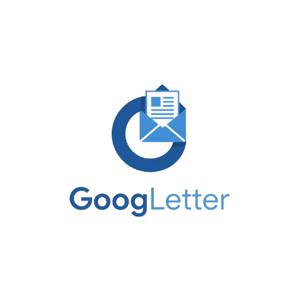

# 📧 GoogLetter - Newsletter Pro

A modern, user-friendly newsletter management application that integrates seamlessly with Google Docs and Gmail. Create, manage, and send professional newsletters with ease.



## 🌟 Features

### ✅ **Core Features (MVP)**
- 🔐 **Google OAuth Authentication** - Secure sign-in with Google
- 📝 **Rich Text Editor** - Professional newsletter creation with TipTap
- 📄 **Google Docs Integration** - Import content directly from Google Docs
- 🎨 **Professional Templates** - Pre-built newsletter templates
- 👥 **Subscriber Management** - Add, edit, and organize subscribers
- 📧 **Email Sending** - Send newsletters via Gmail API
- 🎯 **Personalization** - Dynamic content with {{name}}, {{email}} tokens
- 📊 **Analytics Dashboard** - Track performance and engagement
- 📱 **Responsive Design** - Works on all devices

### 🚧 **In Development**
- 📅 Email scheduling
- 📁 CSV import/export
- 🔍 Advanced analytics
- ⚙️ Settings management

## 🛠️ Technology Stack

- **Framework**: Next.js 15.5.3 with App Router
- **Language**: TypeScript
- **Styling**: Tailwind CSS 4 with custom design system
- **Authentication**: Supabase Auth with Google OAuth
- **Database**: Supabase (PostgreSQL)
- **Rich Text Editor**: TipTap with email-safe extensions
- **Charts**: Recharts for analytics
- **UI Components**: Custom component library with Radix UI
- **Email Sending**: Gmail API integration
- **Google APIs**: Google Docs API, Google Drive API

## 🚀 Getting Started

### Prerequisites
- Node.js 18+
- npm/yarn/pnpm
- Google Cloud Console project with APIs enabled
- Supabase project

### Installation

1. **Clone the repository**
```bash
git clone https://github.com/Tellivision/newsletter.git
cd newsletter
```

2. **Install dependencies**
```bash
npm install
# or
yarn install
# or
pnpm install
```

3. **Environment Setup**
Create a `.env.local` file in the root directory:
```env
# Supabase
NEXT_PUBLIC_SUPABASE_URL=your_supabase_url
NEXT_PUBLIC_SUPABASE_ANON_KEY=your_supabase_anon_key
SUPABASE_SERVICE_ROLE_KEY=your_service_role_key

# Google OAuth (configured in Supabase)
# No additional env vars needed for Google OAuth
```

4. **Run the development server**
```bash
npm run dev
# or
yarn dev
# or
pnpm dev
```

5. **Open your browser**
Navigate to [http://localhost:3000](http://localhost:3000)

## 📁 Project Structure

```
src/
├── app/                    # Next.js App Router pages
│   ├── analytics/         # Analytics dashboard
│   ├── api/              # API routes
│   ├── auth/             # Authentication pages
│   ├── editor/           # Newsletter editor
│   ├── subscribers/      # Subscriber management
│   └── templates/        # Template gallery
├── components/           # Reusable UI components
│   ├── editor/          # Rich text editor components
│   ├── google-docs/     # Google Docs integration
│   ├── layout/          # Layout components
│   ├── newsletters/     # Newsletter-specific components
│   └── ui/              # Base UI components
├── contexts/            # React contexts
├── lib/                 # Utility libraries
├── types/               # TypeScript type definitions
└── middleware.ts        # Next.js middleware
```

## 🎨 Design System

GoogLetter uses a custom design system with a professional blue color palette:

- **Primary**: `#2563eb` (Blue 600)
- **Secondary**: `#1e40af` (Blue 700)
- **Accent**: `#60a5fa` (Blue 400)
- **Gray**: `#f8fafc` (Slate 50)

## 🔧 Configuration

### Google APIs Setup
1. Enable Google Docs API and Gmail API in Google Cloud Console
2. Configure OAuth consent screen
3. Add authorized redirect URIs in Supabase Auth settings

### Supabase Setup
1. Create a new Supabase project
2. Enable Google OAuth provider
3. Set up database tables (see `src/types/supabase.ts`)

## 📊 Features Overview

### Dashboard
- Welcome header with user personalization
- Key metrics (subscribers, newsletters, engagement)
- Quick action buttons
- Recent activity overview

### Newsletter Editor
- Rich text editor with email-safe fonts
- Google Docs import functionality
- Live preview mode
- Template integration
- Personalization tokens

### Subscriber Management
- Add/edit/delete subscribers
- Search and filtering
- Status management (active, inactive, bounced)
- Tagging system

### Analytics
- Delivery performance charts
- Engagement trends
- Device breakdown
- Time range filtering

## 🤝 Contributing

1. Fork the repository
2. Create a feature branch (`git checkout -b feature/amazing-feature`)
3. Commit your changes (`git commit -m 'Add amazing feature'`)
4. Push to the branch (`git push origin feature/amazing-feature`)
5. Open a Pull Request

## 📄 License

This project is licensed under the MIT License - see the [LICENSE](LICENSE) file for details.

## 🙏 Acknowledgments

- Built with [Next.js](https://nextjs.org/)
- UI components inspired by [shadcn/ui](https://ui.shadcn.com/)
- Icons by [Lucide](https://lucide.dev/)
- Fonts by [Vercel](https://vercel.com/font)

## 📞 Support

For support, email support@googleletter.com or create an issue on GitHub.

---

**Made with ❤️ for newsletter creators everywhere**
